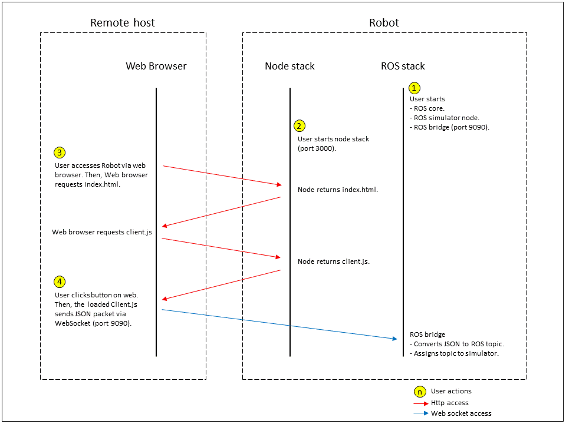
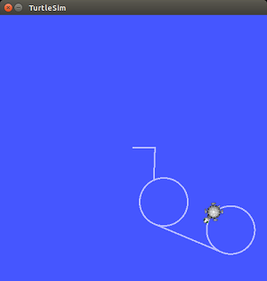

# rosbridge-usage

## Description
This repository provides a basic usage and related files for rosbridge.

Users can:
- set up a turtlebot simulator on linux host and control a turtlebot, which in the simulator, via web browser.
- learn the essential structure for rosbridge.
- have source and scripts.

## Maintainer
- [SJ Kim](http://bus710.net) <<bus710@gmail.com>>  

## Table of contents
- [Description](#description)
- [Requirement](#requirement)
- [Installation](#installation)
- [Edit](#edit)
- [Launch](#launch)
- [Commentary](#commentary)
- [Result](#result)
- [Reference](#reference)

## Requirement
- Ubuntu 14.04
- ROS Indigo Desktop Full
- git
- node.js & npm

## Installation
```
cd ~
sudo apt-get install nodejs npm
sudo apt-get install ros-indigo-rosbridge-*
sudo apt-get install ros-indigo-turtlesim-*
git clone http://github.com/bus710/rosbridge-usage.git
cd ~/rosbridge-usage
npm install
```

## Edit
Before you launch the stacks, you should edit <b>scripts/client.js</b> file to match the host variable and your robot's ip address.
```
# the basic value is:
var host = 'ws://192.168.0.5:3000';

# if the robot's ip address is 192.168.0.7, then edit the variable as:
var host = 'ws://192.168.0.7:3000';
```
This will be automated when I apply Angular.js.


## Launch
```
# run below commands in each terminal.
roscore
rosrun turtlesim turtlesim_node
rosrun turtlesim turtle_teleop_key
roslaunch rosbridge_server rosbridge_websocket.launch

# run below commands in one terminal
cd ~/rosbridge-usage
node app.js

# access your linux host from another device's web browser.
# the address might be 192.168.0.x and the port is 3000.
# of course, the linux host and another device should use same wireless network.
```

## Commentary
This image explains the sequence between the robot and browser.  


## Result
This iamges show the web page and the result in the simulator.

- Web page
  

- Simulator
  

## Reference
- http://wiki.ros.org/rosbridge_suite
- http://iguanatronics.com/simple-tutorial-on-rosbridge-and-roslibjs/
- https://www.digitalocean.com/community/tutorials/how-to-install-node-js-on-an-ubuntu-14-04-server
